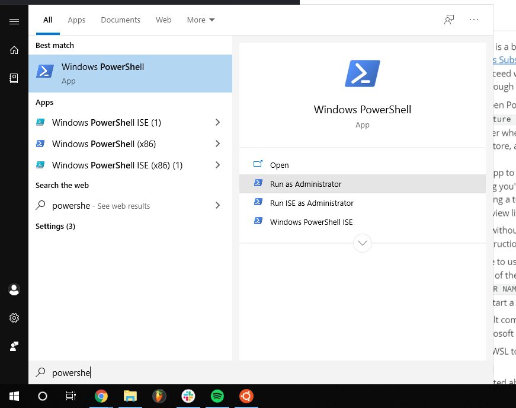

# Prerequisites

## MacOS

-  If you're on MacOS, [homebrew](https://brew.sh/) is a must have developer tool! Verify it's installed with `brew --version`
-  The default terminal app isn't great, [iterm 2](https://iterm2.com) is a better alternative

## Windows

Development on windows is a bit tedious due to it not running in a unix shell. So, it's a good idea to install the [Windows Subsystem For Linux](https://docs.microsoft.com/en-us/windows/wsl/install-win10) (called the WSL for short). This is not required, and you *can* proceed without it, but this guide will be assuming we're working in a unix shell. When going through this installation, select the latest version of Ubuntu available.

1. To install the WSL, open PowerShell **as administrator**.

   

2. run the following command `Enable-WindowsOptionalFeature -Online -FeatureName Microsoft-Windows-Subsystem-Linux`

3. Restart your computer when prompted

4. Open the Microsoft store, and search for Ubuntu. Install either Ubuntu 20.04 LTS or 18.04 LTS

5. Launch the Ubuntu app to complete installation.

6. Follow this guide assuming you're a Linux (Ubuntu) user. 
   - For any development work requiring a terminal, use the WSL.
   - Run the Ubuntu app you installed or one of the below alternative terminals

### Alternative Terminals (Optional, But Strongly Recommended)

#### Windows Terminal (Preview)

The new Windows Terminal can be installed from the Microsoft store.

Once installed, you may want to set the WSL as the default profile in the terminal settings

1. press `ctrl + , ` to open the configuration settings
2. copy the guid listed above `"name": "Ubuntu..."` (for example `07b52e3e-de2c-5db4-bd2d-ba144ed6c273`) 
3. paste it in to the `defaultProfile`

#### Hyper.JS

 [hyper terminal](https://hyper.js) is another good alternative.

Once installed, you may want to set the WSL as the default profile.

1. press `ctrl + , ` to open the configuration settings
2. There is a line containing a `shell:` field. Set this line to:  `shell: 'C:\\Windows\\System32\\bash.exe',`


**Note: if you do not choose to use one of these terminal apps, your windows user's home directory is found at `/mnt/c/Users/<YOUR USER NAME>`. `cd` to that directory to navigate the windows file-system.**

# Our Tech Setup (Please get Linux/WSL before you do this)

If you are running a unix shell (Linux, MacOS, WSL), these installation steps can be automated by running the `setup-dev.sh` script. `cd` into the directory where this script is located, and run `./setup-dev.sh`.

Otherwise, installation can be done by following the below instructions.

## Git

Install [git](https://git-scm.com/downloads) if you don't already have it. Verify it's installed with `git --version` 
IMPORTANT: Perform a [pull request](https://opensource.com/article/19/7/create-pull-request-github). This is essential every time you try to contribute to the project. NEVER push directly to MAIN without consent from the project manager.

## Node

It's a good idea to use the [node version manager](https://github.com/nvm-sh/nvm#install--update-script) to manage multiple node versions. Open a new terminal instance, and check if nvm installed correctly: `nvm --version`

Run the following commands69:

```bash
npm install -g npm
sudo apt-get install build-essential
```

## Recommended Installations

- [React Developer Tools](https://chrome.google.com/webstore/detail/react-developer-tools/fmkadmapgofadopljbjfkapdkoienihi?hl=en)
- [Visual Studio Code](https://code.visualstudio.com/)
- Simple React Snippets (within VS Code)
- Prettier - Code Formatter (within VS Code)

## Backend Setup (Frontend people are temporarily not required to do this)

### Brew

Install [Brew](https://brew.sh/) if you don't already have it.

### MongoDB Community Edition (not required)

Install [MongoDB Community Edition](https://docs.mongodb.com/manual/administration/install-community/) for convenience. This only helps you test/debug more efficiently in your local environment. You can still choose to use the online MongoDB service.

### Postman (works exactly like playground, but better)

Install [Postman](https://www.postman.com/downloads/) if you don't already have it.


